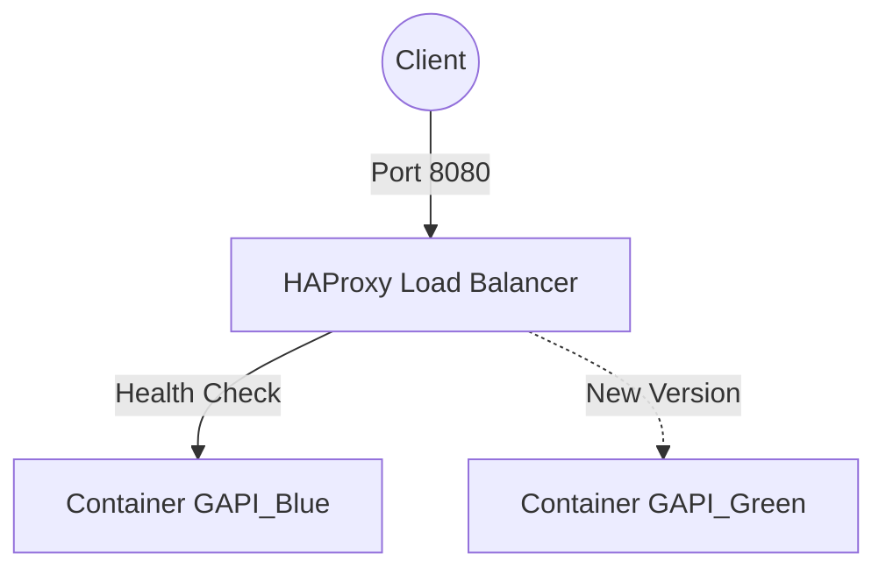

# Тестовое задание для GREEN-API (DevOps/SysAdmin)

Данный проект представляет собой реализацию клиентской части для работы с методами [GREEN-API](https://green-api.com) и отказоустойчивую инфраструктуру для её развертывания.

## 🛠 Стек технологий
* **Frontend:** HTML5, JavaScript (Fetch API)
* **Web Server:** Nginx (на базе образа Alpine)
* **Orchestration:** Docker, Docker Compose
* **Traffic Control:** HAProxy (Load Balancer, Reverse Proxy)
* **CI/CD:** GitHub Actions, Docker Hub
* **Infrastructure:** Docker, VPS (Self-hosted)

## 🚀 Функционал
Реализован интерфейс для выполнения следующих требований задания:
* **getSettings** — получение настроек инстанса.
* **getStateInstance** — получение состояния инстанса.
* **sendMessage** — отправка текстового сообщения.
* **sendFileByUrl** — отправка файла по прямой ссылке.

**Безопасность:** Параметры подключения (`idInstance`, `apiTokenInstance`) вводятся пользователем в интерфейсе и не сохраняются в коде проекта.

## 🏗 Архитектура и Deployment
В проекте реализована стратегия Blue-Green Deployment для исключения простоев при обновлении версии.


## 📦 Локальный запуск
Для быстрого развертывания окружения, идентичного Production:
1. Создать `docker-compose.yml`:
```yml
services:
  haproxy:
    image: haproxy:2.9-alpine
    container_name: haproxy
    ports:
      - "8080:80"
    volumes:
      - ./haproxy.cfg:/usr/local/etc/haproxy/haproxy.cfg:ro
    depends_on:
      - gapi_blue
      - gapi_green
    restart: unless-stopped
    networks:
      - gapi_network

  gapi_blue:
    image: kijyra/gapi
    container_name: gapi_blue
    restart: unless-stopped
    networks:
      - gapi_network

  gapi_green:
    image: kijyra/gapi
    container_name: gapi_green
    restart: unless-stopped
    networks:
      - gapi_network

networks:
  gapi_network:
    driver: bridge
```
2. Создать `haproxy.cfg`
```cfg
global
    daemon
    maxconn 99
    ssl-default-bind-ciphers ECDHE-ECDSA-AES128-GCM-SHA256:ECDHE-RSA-AES128-GCM-SHA256
    ssl-default-server-ciphers ECDHE-ECDSA-AES128-GCM-SHA256:ECDHE-RSA-AES128-GCM-SHA256

defaults
    mode http
    timeout connect 5s
    timeout client 30s
    timeout server 30s

frontend http_front
    bind *:80
    acl is_api path_beg /api/

    use_backend green_api if is_api
    default_backend frontend

backend frontend
    balance roundrobin
    option httpchk GET /

    server blue gapi_blue:80 check rise 2 fall 3
    server green gapi_green:80 check rise 2 fall 3

# GREEN API proxy
backend green_api
    http-request replace-path ^/api/(.*)$ /\1

    http-response set-header Access-Control-Allow-Origin "*"
    http-response set-header Access-Control-Allow-Methods "GET, POST, OPTIONS"
    http-response set-header Access-Control-Allow-Headers "Content-Type"

    server greenapi api.green-api.com:443 ssl verify required ca-file /etc/ssl/certs/ca-certificates.crt

```
3. Запуск:
```bash
docker-compose up -d
```
4. Приложение будет доступно по адресу http://localhost:8080

## ⚙️ CI/CD Pipeline (GitHub Actions)
При пуше нового тега (`v*.*.*`) запускается автоматический процесс:
1. **Build & Push:** Сборка оптимизированного Docker-образа и отправка в Docker Hub.
2. **CD (Deploy):** Подключение к VPS по SSH и выполнение скрипта деплоя.
3. **Rollout:** Запуск нового контейнера, проверка его готовности и удаление устаревшей версии.
4. **Cleanup:** Автоматическая очистка неиспользуемых образов (docker image prune).

### Особенности конфигурации:
* **High Availability:** HAProxy выполняет роль входной точки, проверяя доступность backend-контейнеров (health checks).
* **Zero-Downtime:** Обновление приложения происходит путем запуска новой версии параллельно со старой и плавным переключением трафика.
* **Infrastructure-as-Code:** Вся конфигурация сервисов (Nginx, HAProxy, Compose) версионируется в Git.
* **Health Checks:** HAProxy периодически проверяет доступность backend-контейнеров через `GET /`. Если сервер не отвечает, он автоматически исключается из балансировки до восстановления.
* **Rollback:** В случае проблем с новой версией достаточно остановить новый контейнер и перезапустить старый. HAProxy автоматически вернёт трафик на работающий экземпляр.

## 🔗 Ссылки
* Демо-страница: http://217.114.0.78:8080
* Репозиторий GitHub: https://github.com/kijyra/gapi
* Видео-презентация: [Ссылка на видео/Google Drive](https://drive.google.com/file/d/none/view?usp=sharing)
